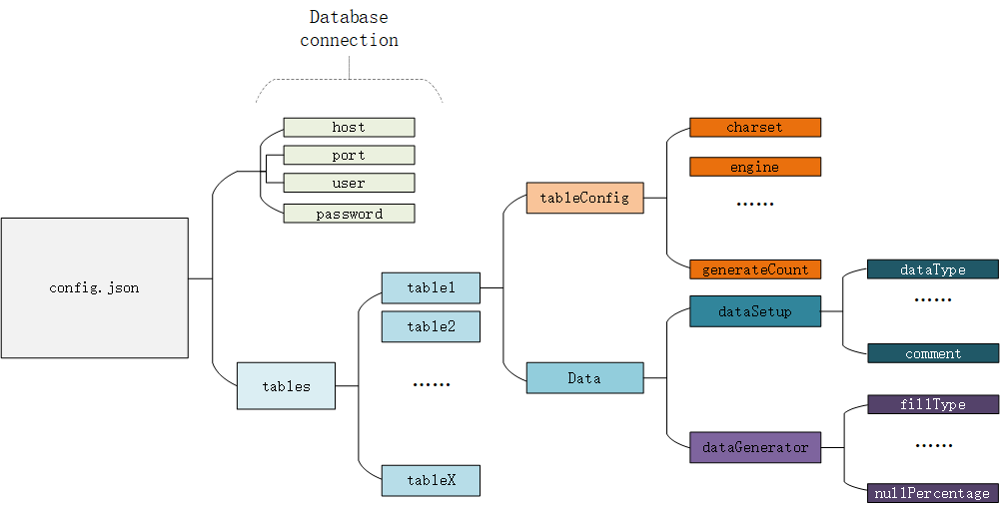

# AddSql
A tool for mysql database testing.

This simple script can generate random data based on the Datatypes defined in [config.json](config/config.json). You can also set certain percentage of the data to (NULL).

json format:

##### tableConfig
settings for creating a new table,like
```json
"tableConfig": {
                "database": "testdb",
                "dropIfExists": false,
                "charset": "utf8mb4",
                "engine": "innodb",
                "comment": "test",
                "generateCount": 1
            },
```
* "generateCount":100<br>
Insert 100 new records into the table containing generated data.


##### dataSetup
data attributes, for example:
```json
"dataSetup": {
                        "dataType": "int",
                        "length/set": "10",
                        "unsigned": true,
                        "allowNull": false,
                        "zerofill": false,
                        "hasDefault": false,
                        "comment": "id"
                    },
```
##### dataGenerator
settings for data generator that generates random data.
```json
"dataGenerator": {
                        "fillType": "random",
                        "nullPercentage": 0
                    }
```
* "fillType":"random"<br>
The generator will generate random data based on the defined dataType.
* "fillType":"selective"<br>
The generator will randomly choose data from list-type "fillEnum" defined in "dataGenerator".

If the dataType of this column belongs to Text category, like "VARCHAR" , you may also add following options in the "dataGenerator" segment:

* "fillChar":"all"<br> 
The filled characters are randomly picked ASCII characters.

* "fillChar":"lowercase"<br> 
The filled characters are randomly picked lowercase ASCII characters.

* "fillChar":"uppercase"<br> 
The filled characters are randomly picked uppercase ASCII characters.

* "fillChar":"numeric"<br> 
The filled characters are randomly picked numeric ASCII characters.

* "fillChar":"alphanumeric"<br> 
The filled characters are randomly picked alphanumeric ASCII characters.


Currently supported datatypes:
TINYINT,SMALLINT,MEDIUMINT,INT,BIGINT,BIT,FLOAT,DOUBLE,VARCHAR.

